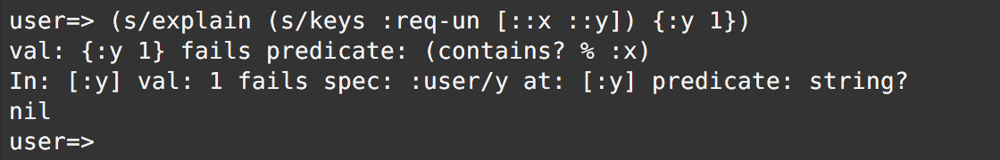
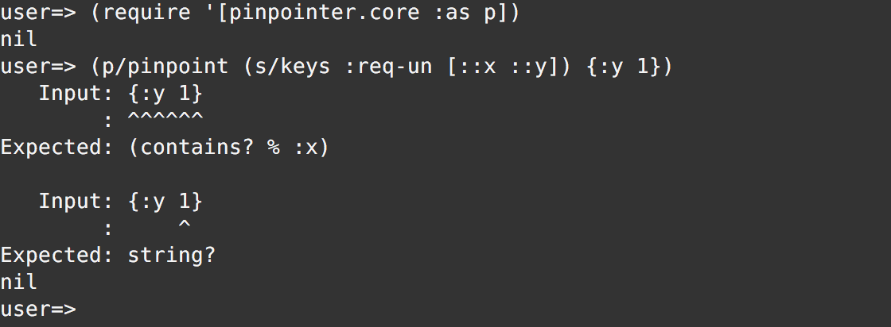

# Pinpointer

_Pinpointer_ aims to enhance `clojure.spec/explain` facility and make it easy to grasp which part of data is violating spec conformance.

**Notice**: Pinpointer is built on top of `clojure.spec`, which is one of the most actively developed features of Clojure 1.9. So, it's very fragile by nature, and its APIs are also highly subject to change.

## Installation

Add the following line to your `:dependencies`:

    [pinpointer "0.1.0-SNAPSHOT"]

## Description
In Clojure 1.9, `clojure.spec` provides an API named `explain` that (as its name suggests) explains which part of the code causes a conformance failure:

The results of `c.s/explain`, however, don't look very human-friendlily formatted, and it's likely to take a while to identify where the actual problem is.

Pinpointer provides APIs similar to `c.s/explain` and related ones, and they show us the problem part in a more easy-to-grasp manner:

Moreover, you can also highlight the part by adding the option `{:colorize :ansi}`

## License

Copyright © 2016 Shogo Ohta

Distributed under the Eclipse Public License either version 1.0 or (at
your option) any later version.
