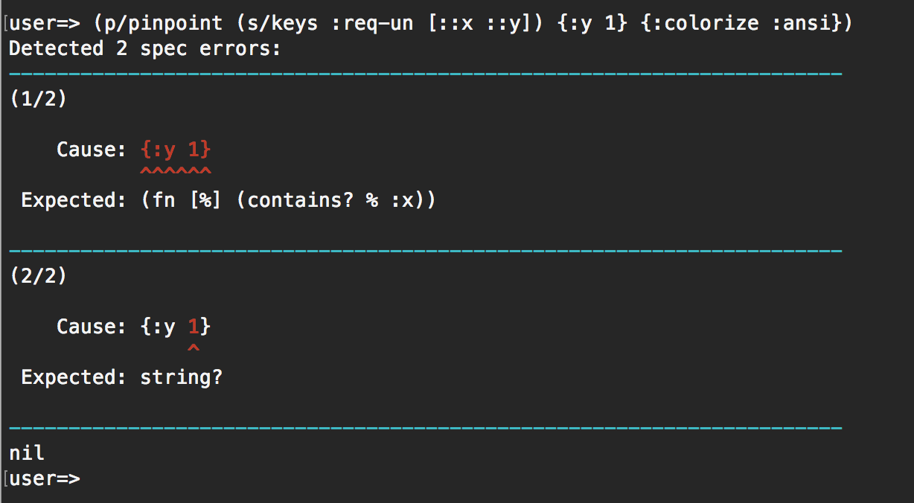

# Pinpointer
[](https://clojars.org/pinpointer)

Pinpointer aims to enhance `clojure.spec/explain` facility and make it easy to grasp which part of data is causing the spec error.

**Notice**: Pinpointer is built on top of `clojure.spec`, which is one of the most actively developed new features of Clojure. So, it's very fragile by nature, and its APIs are also highly subject to change.

Pinpointer heavily uses [`spectrace`](https://github.com/athos/spectrace), a fine-grained spec error analyzer, to analyze the errors and report them as precise as possible.

## Installation

Add the following to your `:dependencies`:

[](http://clojars.org/pinpointer)

## Why and how to use it

`clojure.spec(.alpha)` provides an API named `explain`, which (as its name suggests) explains which part of the code causes a spec error:

```clj
=> (s/def ::x integer?)
:user/x
=> (s/def ::y string?)
:user/y
=> (s/explain (s/keys :req-un [::x ::y]) {:y 1})
In: [:y] val: 1 fails spec: :user/y at: [:y] predicate: string?
val: {:y 1} fails predicate: (contains? % :x)
:clojure.spec.alpha/spec  #object[clojure.spec.alpha$map_spec_impl$reify__695 0x47cb4017 "clojure.spec.alpha$map_spec_impl$reify__695@47cb4017"]
:clojure.spec.alpha/value  {:y 1}
nil
=>
```

As you can see, however, the result of `explain` doesn't look very human-friendlily formatted, and it's likely to take a while to find out where the actual problem is.

### pinpoint: replacement of s/explain

_Pinpointer_ provides APIs compatible with `explain` and displays the problematic parts in an easier-to-grasp manner:

```clj
=> (require '[pinpointer.core :as p])
nil
=> (p/pinpoint (s/keys :req-un [::x ::y]) {:y 1})
Detected 2 spec errors:
----------------------------------------------------------------------
(1/2)

    Input: {:y 1}
           ^^^^^^
 Expected: (fn [%] (contains? % :x))

----------------------------------------------------------------------
(2/2)

    Input: {:y 1}
               ^
 Expected: string?

----------------------------------------------------------------------
nil
=>
```


You can also colorize the report by adding the option `{:colorize :ansi}`:



### pinpoint-out: plugin implementation for s/\*explain-out\*

If you'd rather like to completely replace the `explain` facility for any kinds of spec error reporting, it would be helpful to replace `s/*explain-out*` with `pinpointer.core/pinpoint-out` instead:

```clj
=> (set! s/*explain-out* p/pinpoint-out)
#function[pinpointer.core/pinpoint-out]
=>
;; from now on, p/pinpoint-out will be used in place of s/explain-printer
=>
=> (defn f [x] (inc x))
#'user/f
=> (s/fdef f
     :args (s/cat :x (s/and integer? even?))
     :ret (s/and integer? odd?))
user/f
=> (require '[clojure.spec.test.alpha :as t])
nil
=> (t/instrument)
[user/f]
=> (f 3)
ExceptionInfo Call to #'user/f did not conform to spec:
Detected 1 spec error:
----------------------------------------------------------------------
(1/1)

    Input: (3)
            ^
 Expected: even?

----------------------------------------------------------------------
  clojure.core/ex-info (core.clj:4725)
=>
```

## License

Copyright © 2016 Shogo Ohta

Distributed under the Eclipse Public License either version 1.0 or (at
your option) any later version.
